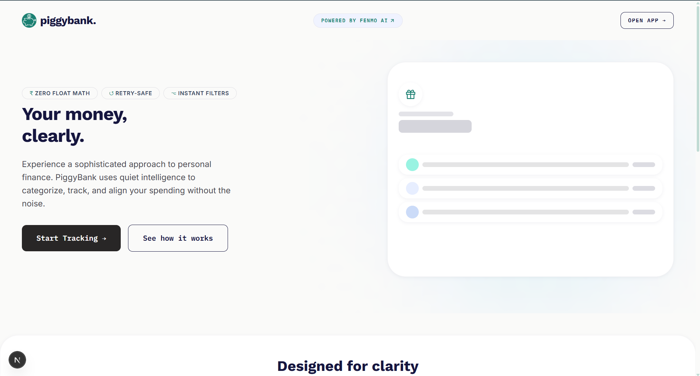
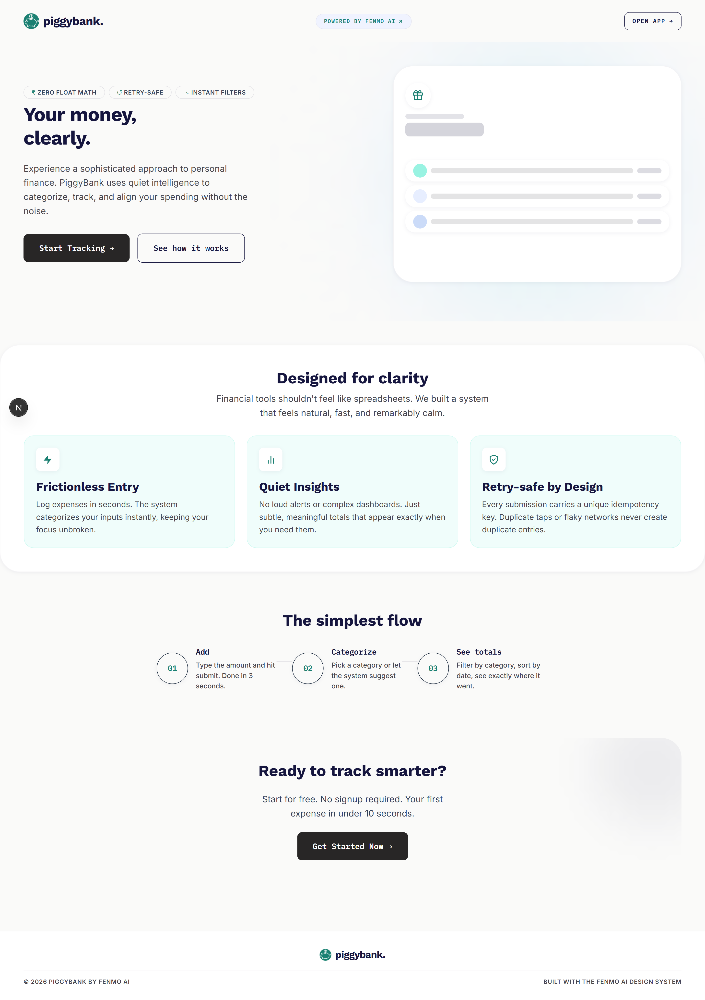
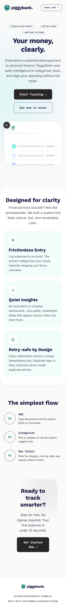
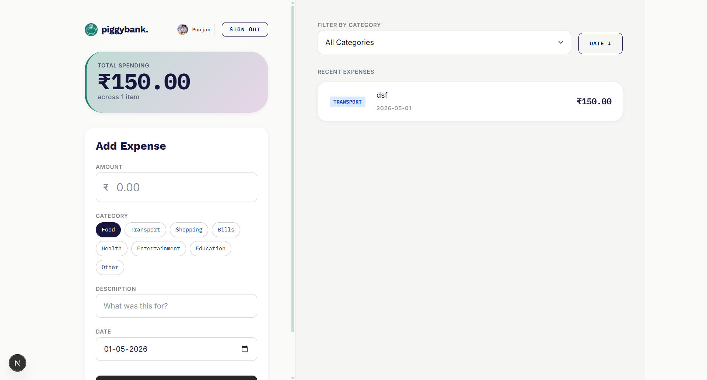
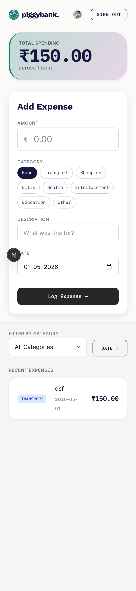
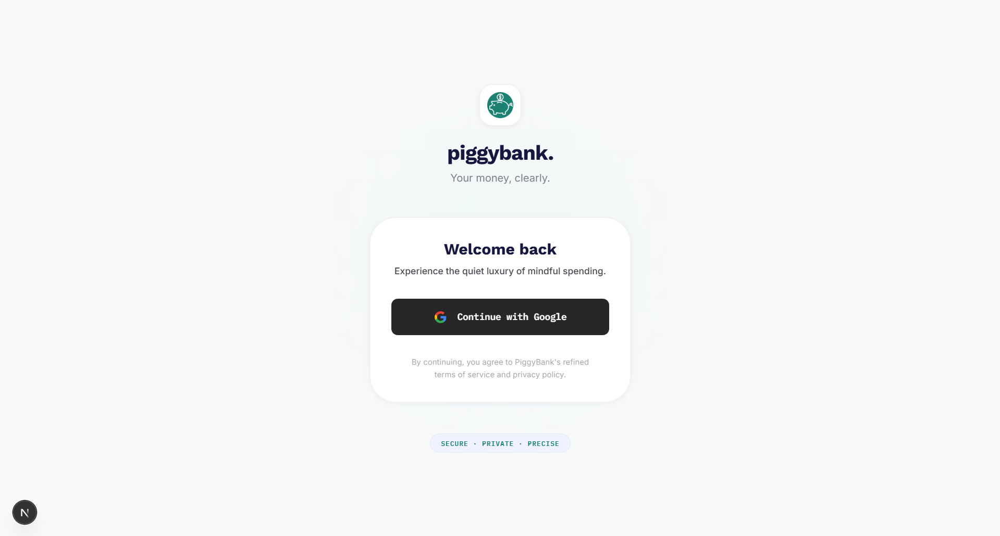
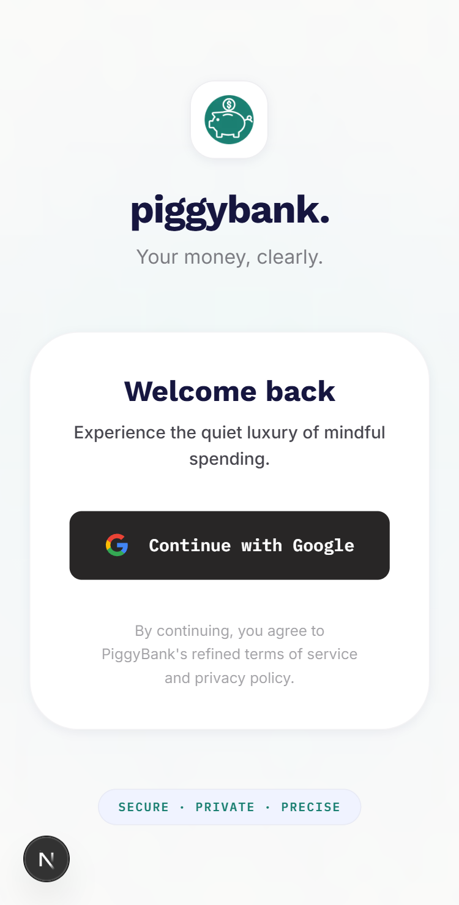

#  PiggyBank by Fenmo

> **Quiet Luxury Fintech.** Your money, clearly.

[](https://fenmo-piggy-bank.vercel.app)
[](https://github.com/Poojan38380/piggy-bank)

Personal finance tools shouldn't feel like spreadsheets. PiggyBank is a high-performance expense tracker built for clarity and correctness, prioritizing data integrity and "quiet" interactions over flashy, unnecessary features.

---

## 📱 Interface

### Landing & Conversion


<table width="100%">
  <tr>
    <td width="66%"></td>
    <td width="33%"></td>
  </tr>
</table>

### Dashboard & Tracking
<table width="100%">
  <tr>
    <td width="66%"></td>
    <td width="33%"></td>
  </tr>
</table>

### Secure Access
<table width="100%">
  <tr>
    <td width="66%"></td>
    <td width="33%"></td>
  </tr>
</table>

---

## 🏗️ The Hard Parts

### Atomic Idempotency
Unreliable networks are a reality in fintech. Most apps handle this by "hoping" the user doesn't double-click. We handle it with a unique constraint at the database layer.

1. **Client**: Generates a UUID v4 on form mount.
2. **Request**: Sends the `idempotencyKey` with every POST.
3. **Server**: Attempts a `prisma.expense.create`.
4. **Collision**: If MongoDB throws a `P2002` (Duplicate Key) on the `idempotencyKey` index, the server catches it, fetches the existing record, and returns it with a `200 OK` instead of failing.

```text
User clicks "Add" -> UUID: 8af7... -> Server -> Create (Success)
User double-clicks -> UUID: 8af7... -> Server -> Catch P2002 -> Return Existing
```

### Money as Integer Paise
Floating point math in JavaScript is dangerous for currency (`0.1 + 0.2 !== 0.3`). PiggyBank treats money as a primitive integer representing paise.

- **Storage**: `149.99` is stored as `14999`.
- **Logic**: All arithmetic (summing totals) happens in paise.
- **Boundary**: Conversion only occurs during user input and final display formatting.

```typescript
// lib/money.ts
export function toPaise(input: string): number | null {
  const float = parseFloat(input);
  return Math.round(float * 100); // 149.99 -> 14999
}

export function paiseToRupees(paise: number): number {
  return paise / 100; // 14999 -> 149.99
}
```

### Filter State in URL
Filters (category, sort order) are not hidden in local component state. They are managed via URL search parameters.

- **Persistence**: Page refreshes don't reset your view.
- **Sharability**: Copy-pasting the URL preserves the exact filtered list.
- **Logic**: `useExpenses` hook synchronizes `useSearchParams` with the API fetch cycle.

```typescript
const searchParams = useSearchParams();
const category = searchParams.get("category"); // Single source of truth
```

### Connection Management
Naive Prisma instantiation in a serverless environment (Next.js API routes) exhausts database connection pools rapidly. PiggyBank implements a global singleton pattern to cache the client across hot reloads.

```typescript
const globalForPrisma = global as unknown as { prisma: PrismaClient }
export const prisma = globalForPrisma.prisma || new PrismaClient()
if (process.env.NODE_ENV !== 'production') globalForPrisma.prisma = prisma
```

---

## 🛠️ Tech Stack

| Dependency | Purpose | Rationale |
| :--- | :--- | :--- |
| **Next.js 16** | Framework | App Router and Server Actions provide the fastest path to a production-grade SSR app. |
| **Prisma** | ORM | Type-safe database access with automated migrations. |
| **MongoDB Atlas** | Database | Flexible schema for expenses with high availability and native ObjectId support. |
| **Auth.js (v5)** | Auth | Secure, session-based authentication that handles OAuth providers natively. |
| **Tailwind 4** | Styling | Drastic reduction in CSS bundle size and better JIT performance. |
| **Sonner** | Toasts | Lighter footprint than react-hot-toast; handles multiple notifications gracefully. |
| **Zod** | Validation | Single source of truth for schemas across client forms and API routes. |

---

## 📐 Architecture Overview

```text
[ Browser (React 19) ]
         |
    ( HTTPS JSON )
         |
[ Next.js API Routes ] <--- [ Auth.js Session ]
         |
[ Prisma Client (Singleton) ]
         |
[ MongoDB Atlas (Replica Set) ]
```

---

## 🎨 Design System

| Token | Value | Rationale |
| :--- | :--- | :--- |
| **Display Font** | Work Sans | High-impact headings with a modern, architectural feel. |
| **Data Font** | IBM Plex Mono | **Non-negotiable** for currency; keeps digits aligned for easy scanning. |
| **Accent Color** | `#1A7F71` (Teal) | A calm, professional alternative to "bank blue" or "startup purple." |
| **Radius** | 10px / 20px / 40px | Progressive rounding from buttons to hero cards to imply luxury. |
| **Spacing** | 24 / 32 / 48px | Generous rhythm to avoid the "cluttered dashboard" trope. |

---

## 🧠 What I Intentionally Did NOT Build

- **No Redux**: The application state is tied to the server (via URL) and local hooks. Redux would be architectural overkill for this scope.
- **No Pagination**: For a personal expense tracker, fetching < 1,000 items is more performant than the overhead of managing paginated state and infinite scrolls.
- **No Category Relations**: Expenses store categories as denormalized strings. This simplifies queries and avoids expensive joins for a feature that rarely changes.

---

## ⚖️ Trade-offs & Future Work

- **Auth Scope**: Only Google/GitHub providers are implemented for the timebox. Production would require email/magic-link.
- **Multi-Currency**: The system is hardcoded to INR. An `ExchangeRate` service and `currency` column in the `Expense` model would be the next step.
- **Bulk Actions**: Currently, expenses are managed one by one. A batch-select interface for bulk categorization would be required for power users.

---

## 🚀 Local Setup

```bash
# 1. Install dependencies
pnpm install

# 2. Configure Environment
# Copy .example.env to .env and fill in MONGO_URI and AUTH_SECRET
cp .example.env .env

# 3. Initialize Database
npx prisma db push

# 4. Start Development
pnpm dev
```

---

## 🧪 Edge Cases Handled

| Scenario | Handling Mechanism |
| :--- | :--- |
| **Double Submit** | Idempotency key uniqueness check at DB level. |
| **Negative Amount** | Zod validation rejects any value <= 0. |
| **Network Failure** | Client-side `useTransition` and loading states prevent UI hanging. |
| **Invalid Date** | Regex-based validation ensures YYYY-MM-DD format before parsing. |
| **Rate Limiting** | In-memory limiter (30 req/min) prevents API abuse. |
| **Float Drift** | `Math.round(val * 100)` ensures 149.99 doesn't become 149.9899. |

---

Built with ❤️ by [Poojan Goyani](https://www.linkedin.com/in/poojan-goyani-404224253) for **Fenmo AI**.
